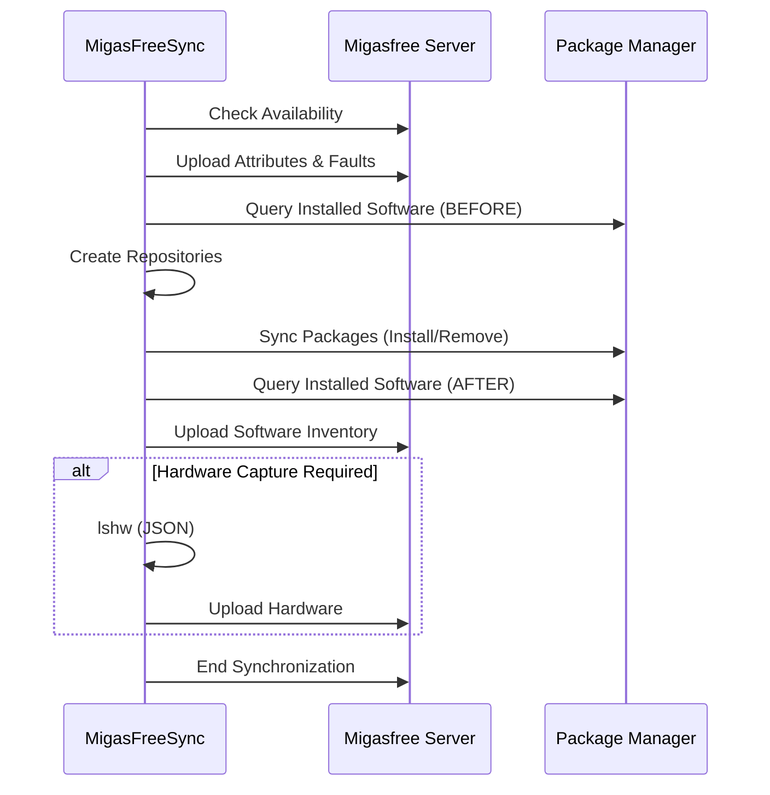

# Architecture Overview

This document explains the internal architecture of migasfree-client and how it interacts with the migasfree server.

## System Overview

migasfree is a systems management solution consisting of two main components:

```text
┌─────────────────┐                    ┌─────────────────┐
│                 │    HTTPS/mTLS      │                 │
│  migasfree      │◄──────────────────►│  migasfree      │
│  client         │    REST API        │  server         │
│                 │                    │                 │
└─────────────────┘                    └─────────────────┘
        │                                      │
        │ Local                                │ Database
        ▼                                      ▼
┌─────────────────┐                    ┌─────────────────┐
│  Package        │                    │  PostgreSQL     │
│  Manager        │                    │  + Storage      │
│  (apt/dnf/...)  │                    │                 │
└─────────────────┘                    └─────────────────┘
```

### Client Responsibilities

- Execute synchronization commands
- Collect and report computer attributes
- Manage local package repositories
- Install/remove packages via the local package manager
- Upload hardware and software inventories
- Configure devices (printers, etc.)
- Manage authentication certificates

### Server Responsibilities

- Store computer inventory and status
- Define deployments (packages to install/remove)
- Manage package repositories
- Define computer attributes and formulas
- Generate reports and statistics

## Client Architecture

```text
migasfree_client/
├── __main__.py          # Entry point
├── command.py           # Base command class & decorators
├── sync.py              # Synchronization logic
├── availability.py      # Server availability check
├── client.py            # HTTP client wrapper
├── url_request.py       # Low-level HTTP requests
├── secure.py            # Cryptographic operations
├── mtls.py              # mTLS certificate management
├── utils.py             # Utility functions
├── settings.py          # Configuration management
└── pms/                 # Package Management Systems
    ├── __init__.py      # PMS factory
    ├── apt.py           # Debian/Ubuntu
    ├── dnf.py           # Fedora
    ├── yum.py           # RHEL/CentOS
    ├── zypper.py        # openSUSE
    ├── pacman.py        # Arch Linux
    ├── apk.py           # Alpine Linux
    └── wpt.py           # Windows
```

### Component Diagram

```text
┌────────────────────────────────────────────────────────────────┐
│                        CLI Entry Point                         │
│                         (__main__.py)                          │
└───────────────────────────────┬────────────────────────────────┘
                                │
                                ▼
┌────────────────────────────────────────────────────────────────┐
│                      Command Base Class                        │
│                        (command.py)                            │
│  ┌──────────────────────────────────────────────────────────┐  │
│  │  - Configuration loading                                 │  │
│  │  - Logging setup                                         │  │
│  │  - mTLS initialization                                   │  │
│  │  - PMS detection                                         │  │
│  └──────────────────────────────────────────────────────────┘  │
└───────────────────────────────┬────────────────────────────────┘
                                │
        ┌───────────────────────┼───────────────────────┐
        ▼                       ▼                       ▼
┌───────────────┐     ┌─────────────────┐     ┌─────────────────┐
│  Sync Command │     │ Register Command│     │ Upload Command  │
│   (sync.py)   │     │   (sync.py)     │     │  (upload.py)    │
└───────┬───────┘     └─────────────────┘     └─────────────────┘
        │
        ▼
┌────────────────────────────────────────────────────────────────┐
│                      URL Request Layer                         │
│                      (url_request.py)                          │
│  ┌──────────────────────────────────────────────────────────┐  │
│  │  - HTTP POST requests with retries                       │  │
│  │  - Request signing/encryption                            │  │
│  │  - Response verification/decryption                      │  │
│  │  - mTLS client certificates                              │  │
│  └──────────────────────────────────────────────────────────┘  │
└───────────────────────────────┬────────────────────────────────┘
                                │
        ┌───────────────────────┼───────────────────────┐
        ▼                       ▼                       ▼
┌───────────────┐     ┌─────────────────┐     ┌─────────────────┐
│    Secure     │     │     mTLS        │     │      PMS        │
│  (secure.py)  │     │   (mtls.py)     │     │  (pms/*.py)     │
│               │     │                 │     │                 │
│  • Sign/Verify│     │  • Certificates │     │  • apt/dnf/yum  │
│  • Encrypt    │     │  • Key import   │     │  • zypper/pacman│
│  • Decrypt    │     │  • CA download  │     │  • apk/wpt      │
└───────────────┘     └─────────────────┘     └─────────────────┘
```

## Synchronization Flow

The `sync` command performs a series of operations in a specific order:



### Server Availability Check

Before starting synchronization, the client checks if the server can accept
new sync requests. This prevents overwhelming the server during peak loads.

**Flow:**

1. **Check migasfree-agent service**: First, the client checks if the
   `migasfree-agent` service is running locally using cross-platform detection:
   - Linux: `service`, `systemctl`, or `rc-service` (OpenRC)
   - Windows: `sc query`

2. **If service is NOT running**: Skip the availability endpoint call and
   proceed directly with synchronization. This is useful for:
   - Development environments without the full stack
   - Deployments without the manager component
   - Legacy setups

3. **If service IS running**: Query the server's availability endpoint:
   - **HTTP 200**: Server is available, proceed with sync
   - **HTTP 429 (Too Many Requests)**: Server is saturated, exit with
     `EAGAIN` and display retry time
   - **Connection error**: Assume available, let sync fail later if needed

## Security Architecture

### Authentication Layers

migasfree-client uses multiple security layers:

```text
┌─────────────────────────────────────────────────────────────────┐
│                     SECURITY LAYERS                             │
├─────────────────────────────────────────────────────────────────┤
│                                                                 │
│  Layer 1: Transport Security (TLS)                              │
│  ─────────────────────────────────                              │
│  • HTTPS encryption for all communications                      │
│  • Server certificate validation                                │
│                                                                 │
│  Layer 2: Mutual TLS (mTLS)                                     │
│  ─────────────────────────────                                  │
│  • Client certificate authentication                            │
│  • Each computer has unique certificate                         │
│  • Certificates managed by administrator                        │
│                                                                 │
│  Layer 3: Message Signing                                       │
│  ────────────────────────                                       │
│  • JWS (JSON Web Signature) for request integrity               │
│  • RSA key pairs (server.pub + project.pri)                     │
│  • Prevents message tampering                                   │
│                                                                 │
│  Layer 4: Message Encryption                                    │
│  ─────────────────────────────                                  │
│  • JWE (JSON Web Encryption) for sensitive data                 │
│  • Protects passwords and sensitive payloads                    │
│                                                                 │
└─────────────────────────────────────────────────────────────────┘
```

### Key Storage

```text
/var/migasfree-client/
├── keys/
│   └── server.example.com/
│       ├── server.pub          # Server's public key (signing)
│       └── MyProject.pri       # Project's private key
└── mtls/
    └── server.example.com/
        ├── cert.pem            # Client certificate
        ├── key.pem             # Client private key (mode 600)
        └── ca.pem              # CA certificate
```

## Package Management Abstraction

The PMS (Package Management System) layer provides a unified interface across different Linux distributions and Windows:

```python
class PMS:
    """Abstract base class for package managers"""
    
    def install(packages: list) -> bool: ...
    def remove(packages: list) -> bool: ...
    def purge(packages: list) -> bool: ...
    def upgrade_all() -> bool: ...
    def search(pattern: str) -> list: ...
    def create_repos(repos: dict) -> bool: ...
    def clean_repos() -> bool: ...
    def get_installed() -> list: ...
```

### Supported Package Managers

| Class    | Distribution   | Package Format |
| -------- | -------------- | -------------- |
| `Apt`    | Debian, Ubuntu | .deb           |
| `Dnf`    | Fedora 22+     | .rpm           |
| `Yum`    | RHEL, CentOS   | .rpm           |
| `Zypper` | openSUSE       | .rpm           |
| `Pacman` | Arch Linux     | .pkg.tar.zst   |
| `Apk`    | Alpine Linux   | .apk           |
| `Wpt`    | Windows 10+    | .msi, .exe     |

## Data Flow

### Request Flow (Client → Server)

```text
┌──────────────┐    ┌──────────────┐    ┌──────────────┐    ┌──────────────┐
│   Python     │    │    Sign      │    │   HTTPS      │    │   Server     │
│   Dict       │───►│   (JWS)      │───►│   + mTLS     │───►│   API        │
│              │    │              │    │              │    │              │
└──────────────┘    └──────────────┘    └──────────────┘    └──────────────┘
     JSON               Signed              mTLS cert
     payload            token               included
```

### Response Flow (Server → Client)

```text
┌──────────────┐    ┌──────────────┐    ┌──────────────┐    ┌──────────────┐
│   Server     │    │   Server     │    │    Client    │    │   Python     │
│   Response   │───►│   Signs      │───►│   Verifies   │───►│   Dict       │
│              │    │   (JWS)      │    │   Signature  │    │              │
└──────────────┘    └──────────────┘    └──────────────┘    └──────────────┘
     JSON               Signed              Verified,
     response           response            decrypted
```

## Configuration Flow

```text
┌─────────────────────────────────────────────────────────────────┐
│                    CONFIGURATION PRECEDENCE                     │
├─────────────────────────────────────────────────────────────────┤
│                                                                 │
│  1. Environment Variables        (Highest Priority)             │
│     └→ MIGASFREE_CLIENT_SERVER, etc.                            │
│                                                                 │
│  2. Command Line Arguments                                      │
│     └→ --debug, --pms, etc.                                     │
│                                                                 │
│  3. Configuration File                                          │
│     └→ /etc/migasfree.conf                                      │
│                                                                 │
│  4. Default Values               (Lowest Priority)              │
│     └→ Hardcoded in settings.py                                 │
│                                                                 │
└─────────────────────────────────────────────────────────────────┘
```

## Error Handling

The client implements a hierarchical error handling strategy:

| Error Type        | Handling           | User Impact              |
| ----------------- | ------------------ | ------------------------ |
| Network errors    | Retry with backoff | Temporary interruption   |
| Auth errors       | Stop and report    | Requires re-registration |
| Package errors    | Continue sync      | Partial completion       |
| Server saturation | Wait and retry     | Delayed execution        |

## See Also

- [Security Model](security.md)
- [CLI Reference](../reference/cli.md)
- [Configuration Reference](../reference/configuration.md)
- [Troubleshooting](../how-to/troubleshooting.md)
