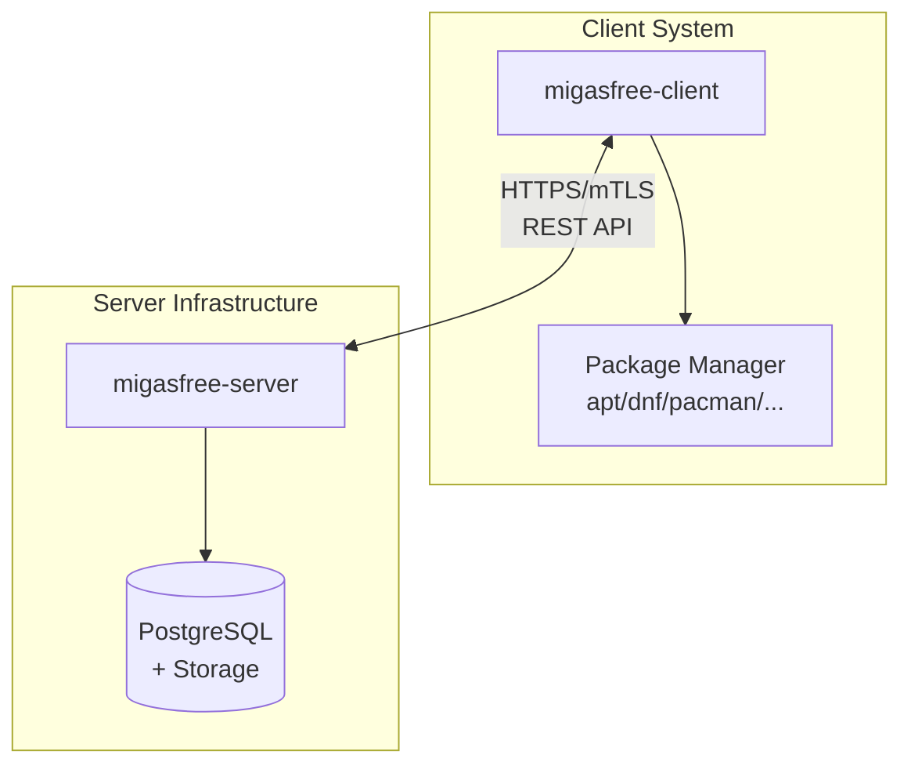
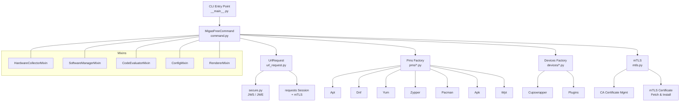
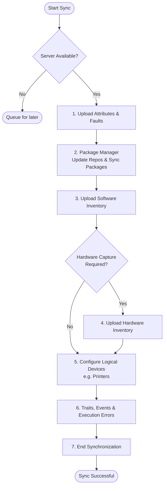
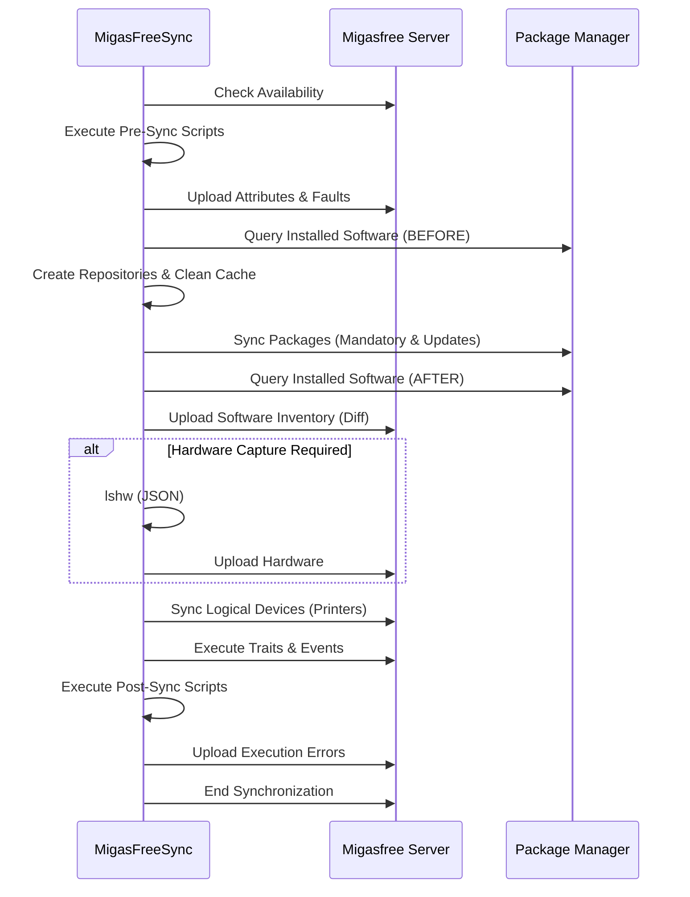
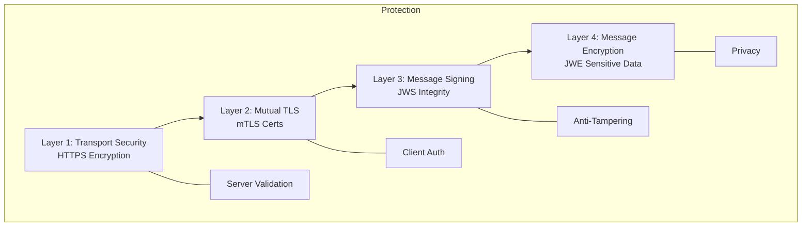

# Architecture Overview

This document explains the internal architecture of migasfree-client and how it interacts with the migasfree server.

## System Overview

migasfree is a systems management solution consisting of two main components:



### Client Responsibilities

- Execute synchronization commands
- Collect and report computer attributes
- Manage local package repositories
- Install/remove packages via the local package manager
- Upload hardware and software inventories
- Configure devices (printers, etc.)
- Manage authentication certificates

### Server Responsibilities

- Store computer inventory and status
- Define deployments (packages to install/remove)
- Manage package repositories
- Define computer attributes and formulas
- Generate reports and statistics

## Client Architecture

```text
migasfree_client/
├── __main__.py          # Entry point & arg parser
├── command.py           # MigasFreeCommand orchestration
├── sync.py              # Synchronization logic
├── upload.py            # Package upload logic
├── info.py              # Computer information retrieval
├── tags.py              # Tag management
├── label.py             # Computer identification (ASCII art)
├── availability.py      # Server availability check
├── url_request.py       # HTTP requests with JWS/JWE + mTLS
├── secure.py            # Cryptographic operations (JWS/JWE)
├── mtls.py              # mTLS certificate management
├── utils.py             # Utility functions
├── settings.py          # Configuration management
├── mixins/
│   ├── config.py        # ConfigMixin (init, SSL, PMS selection)
│   ├── renderer.py      # RendererMixin (console output)
│   ├── evaluator.py     # CodeEvaluatorMixin (traits, faults)
│   ├── hardware.py      # HardwareCollectorMixin (lshw)
│   └── software.py      # SoftwareManagerMixin (PMS ops)
├── devices/             # Device management (Printers, CUPS)
└── pms/                 # Package Management Systems
    ├── __init__.py      # PMS factory + plugin discovery
    ├── pms.py           # Abstract base class
    ├── apt.py           # Debian/Ubuntu
    ├── dnf.py           # Fedora
    ├── yum.py           # RHEL/CentOS
    ├── zypper.py        # openSUSE
    ├── pacman.py        # Arch Linux
    ├── apk.py           # Alpine Linux
    └── wpt.py           # Windows
```

### Component Diagram



## Synchronization Flow

The `sync` command performs a series of operations in a strict, sequential order. Unlike old graphical representations that implied parallel execution, the actual logic executes step-by-step to guarantee integrity.

### High-level Flowchart



### Detailed Sequence Diagram



### Server Availability Check

Before starting synchronization, the client checks if the server can accept
new sync requests. This prevents overwhelming the server during peak loads.

**Flow:**

1. **Check migasfree-agent service**: First, the client checks if the
   `migasfree-agent` service is running locally using cross-platform detection:
   - Linux: `service`, `systemctl`, or `rc-service` (OpenRC)
   - Windows: `sc query`

2. **If service is NOT running**: Skip the availability endpoint call and
   proceed directly with synchronization. This is useful for:
   - Development environments without the full stack
   - Deployments without the manager component
   - Legacy setups

3. **If service IS running**: Query the server's availability endpoint:
   - **HTTP 200**: Server is available, proceed with sync
   - **HTTP 429 (Too Many Requests)**: Server is saturated, exit with
     `EAGAIN` and display retry time
   - **Connection error**: Assume available, let sync fail later if needed

## Security Architecture

### Authentication Layers

migasfree-client uses multiple security layers:



### Key Storage

```text
/var/migasfree-client/
├── keys/
│   └── server.example.com/
│       ├── server.pub          # Server's public key (signing)
│       └── MyProject.pri       # Project's private key
└── mtls/
    └── server.example.com/
        ├── cert.pem            # Client certificate
        ├── key.pem             # Client private key (mode 600)
        └── ca.pem              # CA certificate
```

## Package Management Abstraction

The PMS (Package Management System) layer provides a unified interface across different Linux distributions and Windows:

```python
class PMS:
    """Abstract base class for package managers"""
    
    def install(packages: list) -> bool: ...
    def remove(packages: list) -> bool: ...
    def purge(packages: list) -> bool: ...
    def upgrade_all() -> bool: ...
    def search(pattern: str) -> list: ...
    def create_repos(repos: dict) -> bool: ...
    def clean_repos() -> bool: ...
    def get_installed() -> list: ...
```

### Supported Package Managers

| Class    | Distribution   | Package Format |
| -------- | -------------- | -------------- |
| `Apt`    | Debian, Ubuntu | .deb           |
| `Dnf`    | Fedora 22+     | .rpm           |
| `Yum`    | RHEL, CentOS   | .rpm           |
| `Zypper` | openSUSE       | .rpm           |
| `Pacman` | Arch Linux     | .pkg.tar.zst   |
| `Apk`    | Alpine Linux   | .apk           |
| `Wpt`    | Windows 10+    | .msi, .exe     |

## Data Flow

### Request Flow (Client → Server)

```text
┌──────────────┐    ┌──────────────┐    ┌──────────────┐    ┌──────────────┐
│   Python     │    │    Sign      │    │   HTTPS      │    │   Server     │
│   Dict       │───►│   (JWS)      │───►│   + mTLS     │───►│   API        │
│              │    │              │    │              │    │              │
└──────────────┘    └──────────────┘    └──────────────┘    └──────────────┘
     JSON               Signed              mTLS cert
     payload            token               included
```

### Response Flow (Server → Client)

```text
┌──────────────┐    ┌──────────────┐    ┌──────────────┐    ┌──────────────┐
│   Server     │    │   Server     │    │    Client    │    │   Python     │
│   Response   │───►│   Signs      │───►│   Verifies   │───►│   Dict       │
│              │    │   (JWS)      │    │   Signature  │    │              │
└──────────────┘    └──────────────┘    └──────────────┘    └──────────────┘
     JSON               Signed              Verified,
     response           response            decrypted
```

## Configuration Flow

```text
┌─────────────────────────────────────────────────────────────────┐
│                    CONFIGURATION PRECEDENCE                     │
├─────────────────────────────────────────────────────────────────┤
│                                                                 │
│  1. Environment Variables        (Highest Priority)             │
│     └→ MIGASFREE_CLIENT_SERVER, etc.                            │
│                                                                 │
│  2. Command Line Arguments                                      │
│     └→ --debug, --pms, etc.                                     │
│                                                                 │
│  3. Configuration File                                          │
│     └→ /etc/migasfree.conf                                      │
│                                                                 │
│  4. Default Values               (Lowest Priority)              │
│     └→ Hardcoded in settings.py                                 │
│                                                                 │
└─────────────────────────────────────────────────────────────────┘
```

## Error Handling

The client implements a hierarchical error handling strategy:

| Error Type        | Handling           | User Impact              |
| ----------------- | ------------------ | ------------------------ |
| Network errors    | Retry with backoff | Temporary interruption   |
| Auth errors       | Stop and report    | Requires re-registration |
| Package errors    | Continue sync      | Partial completion       |
| Server saturation | Wait and retry     | Delayed execution        |

## See Also

- [Security Model](security.md)
- [CLI Reference](../reference/cli.md)
- [Configuration Reference](../reference/configuration.md)
- [Troubleshooting](../how-to/troubleshooting.md)
