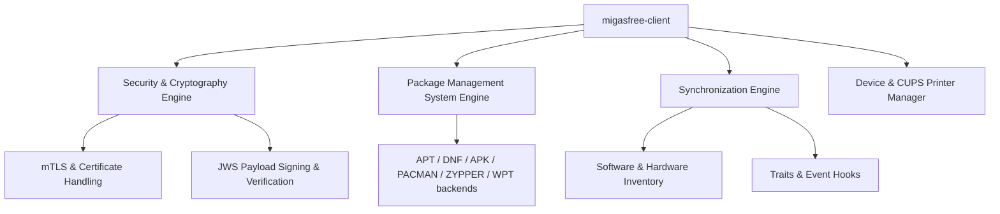

# Migasfree Client — Product Requirements Document (PRD)

> [!NOTE]
> This PRD was reverse-engineered from the codebase of `migasfree-client` (v5.0+) using the `code-to-prd` methodology. It describes the product's functional architecture, CLI subcommands, API specifications, and business rules.

---

## 1. System Overview

**migasfree-client** is the robust client-side agent of the **Migasfree Systems Management System**. It manages automated software deployments, captures detailed hardware/software inventory, configures logical peripherals (printers), and synchronizes state with the Migasfree backend.

Designed for enterprise fleet management, `migasfree-client` runs as a high-privilege CLI utility on both **Linux** (multiple distros: Debian, Alpine, RedHat, SUSE, Arch) and **Windows 10/11** environments.

### Core Business Pillars

1. **Zero-Touch Synchronization (`sync`)**: Fully automates client-server state matching, fetching mandatory package updates, security policies, and applying local configurations.
2. **Mutual Cryptographic Identity (mTLS)**: Employs reciprocal certificate-based validation (mTLS) combined with JWS payload signing for secure, tamper-proof administrative control.
3. **Cross-Platform Package abstraction**: Standardizes package query, search, installation, and purge operations across standard Linux PMS backends and the custom Windows Package Tool (`wpt`).
4. **Dynamic Peripheral Configuration**: Automatically provisions system printers based on location, department, or group traits, handling driver downloads and default assignment.
5. **Decentralized Custom Events**: Integrates pre-sync, post-sync, and traits-driven event folders enabling system administrators to deploy arbitrary scripts executed in strict sequence.

---

## 2. Core Modules

| Module | Subcommands | Core Functionality |
| :--- | :--- | :--- |
| **Identity & Security** | `register`, `import-mtls`, `remove-keys` | Handles machine enrollment, credential verification, cryptographic key generation (`server.pub`, `<project>.pri`), and mTLS certificates import. |
| **State Synchronization** | `sync`, `traits` | Orchestrates full system synchronization including attribute uploads, package updates, hardware/software snapshots, and traits execution. |
| **Package Operations** | `install`, `purge`, `search` | Exposes standard package management routines mapped dynamically to the local OS package manager (APT, DNF, PACMAN, Zypper, WPT). |
| **System Classification** | `tags`, `info`, `label` | Allows reading and writing system taxonomy labels, managing group tags, and retrieving unique system IDs. |
| **Resource Distribution**| `upload` | Empowers authorized packagers to upload packages and package sets directly to the Migasfree server repositories. |
| **Client Configuration** | `conf` | Manages local client options (`/etc/migasfree.conf`) dynamically via the CLI. |

---

## 3. Subcommand Inventory

| Subcommand | Purpose | Access Privilege | Doc Link |
| :--- | :--- | :--- | :--- |
| `sync` | Synchronize client state, software, hardware, and printers with the server. | **Root / Administrator** | [CLI Sync Command](./pages/01-cli-command-sync.md) |
| `register` | Enroll the machine into a project and fetch cryptographic keys. | **Root / Administrator** | [CLI Register Command](./pages/02-cli-command-register.md) |
| `tags` | View or assign tags to categorize the computer on the server. | **Root / Administrator** | [CLI Tags Command](./pages/03-cli-command-tags.md) |
| `upload` | Push custom packages or files to server-side repositories. | **User (Authorized Packager)** | [CLI Upload Command](./pages/04-cli-command-upload.md) |
| `conf` | Configure local settings (Server URL, proxy, package cache, auto-updates). | **Root / Administrator** | [CLI Conf Command](./pages/05-cli-command-conf.md) |
| `info` | Retrieve comprehensive computer metadata and telemetry (UUID, CPU, RAM, status, network). | **Root / Administrator** | [CLI Sync Command](./pages/01-cli-command-sync.md#info) |
| `attributes` | Query assigned organizational attributes and identity (CID). | **Root / Administrator** | N/A |
| `traits` | Query system attributes and configuration traits retrieved from server. | **Public** | [CLI Sync Command](./pages/01-cli-command-sync.md#traits) |
| `label` | Show terminal-rendered identification details for support desks. | **Public** | [CLI Sync Command](./pages/01-cli-command-sync.md#label) |
| `import-mtls`| Bulk-import administrative certificates from a tar archive. | **Root / Administrator** | [CLI Register Command](./pages/02-cli-command-register.md#import-mtls) |
| `remove-keys`| Revoke all local project keys and certificates. | **Root / Administrator** | [CLI Register Command](./pages/02-cli-command-register.md#remove-keys) |

---

## 4. Architectural Rules & Best Practices

> [!IMPORTANT]
>
> - **Python 3.6+ Compatibility**: The entire client codebase strictly maintains compatibility with Python 3.6+. Modern features (e.g., structural pattern matching, f-strings with `=` specifiers) are prohibited to ensure operation on legacy operating systems.
> - **Platform Detection**: Developers MUST use the built-in platform detection helpers in `migasfree_client.utils` (`is_windows()`, `is_linux()`) instead of raw `sys.platform` or negations to ensure seamless cross-platform logic.
