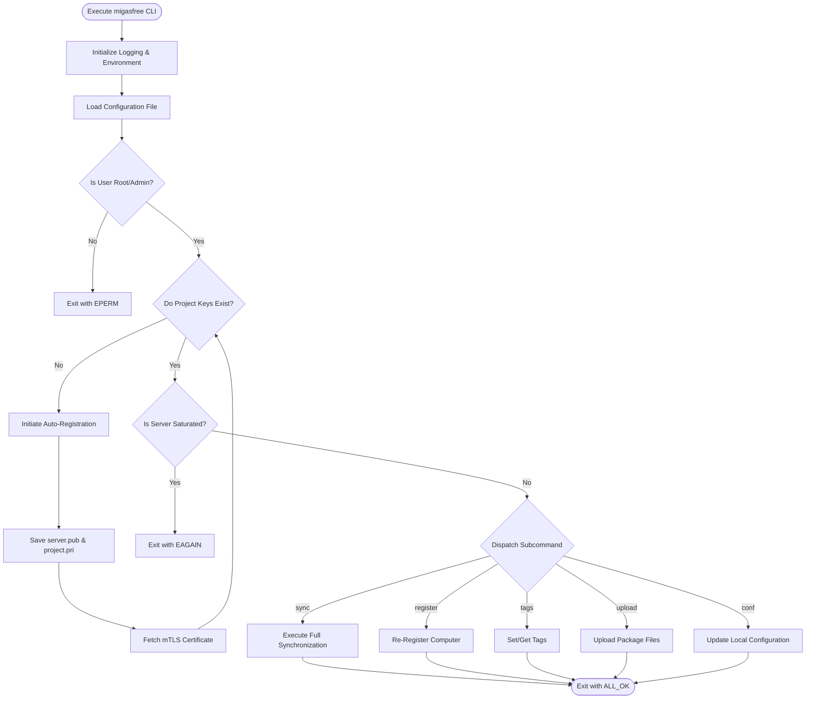

# Command Flow & State Transitions

This document maps out the high-level operational lifecycle, dependency graph, and state transitions of `migasfree-client` sessions.

---

## 1. High-Level Lifecycle & Dependency Graph

`migasfree-client` execution follows a structured, sequential security and configuration validation flow. It verifies identities and states before initiating active workloads.

---

## 2. Cross-Command State Coupling

CLI commands do not run in a continuous UI state machine but share persistent files and database configurations that couple their behaviors.

| Origin Command | Destination Command | Shared Resource | Shared State / Description |
| :--- | :--- | :--- | :--- |
| `register` | `sync` | Cryptographic Keys & Certificates | `register` downloads the asymmetric keys (`server.pub` and `<project>.pri`) and mTLS certificate. Without these, `sync` cannot run and exits with `EPERM`. |
| `sync` | `traits` | `computer_traits.json` | `sync` downloads and updates the global traits profile, caching it locally in JSON format. `traits` reads this cache to display current configuration values. |
| `sync` | Event Hooks | `events.json` & `.env` | `sync` calculates a diff between historical and newly retrieved traits. It writes this difference into `.env` and `.json` in the `events.d` folder and invokes local event scripts. |
| `conf` | All Commands | `migasfree.conf` | Modifying settings (such as proxy, cache, or update flags) via the `conf` command immediately alters the communication and package updates of subsequent runs of `sync`, `register`, or `upload`. |
| `sync` | `info` | Computer ID Cache | `sync` automatically requests and caches the server-assigned internal integer ID. `info` retrieves this cached ID directly to display metadata without making redundant network queries. |
