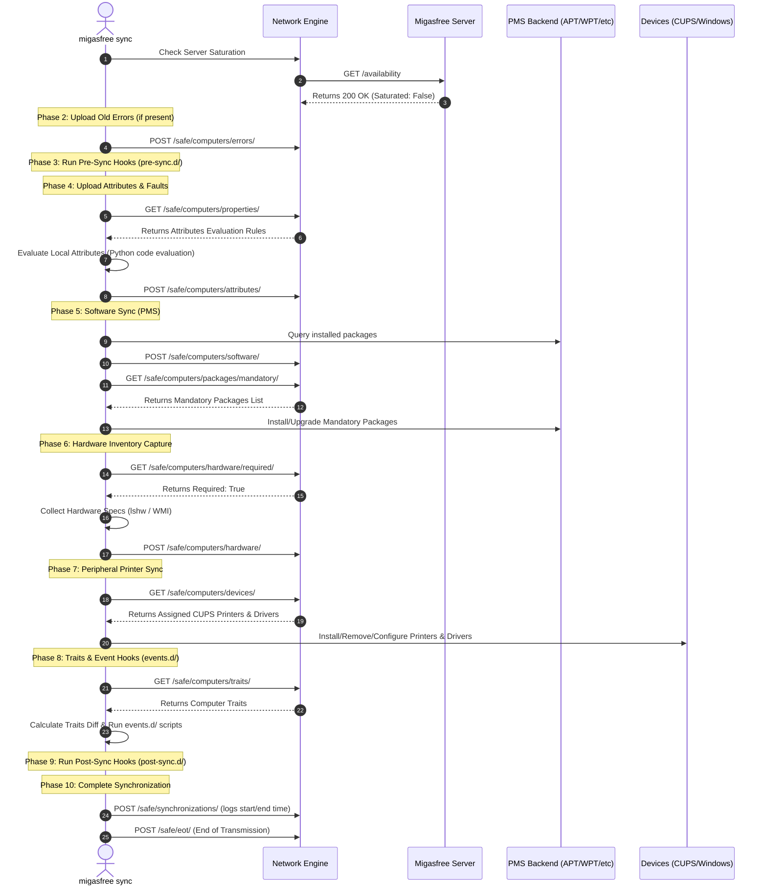

# CLI Command: sync

> **Namespace:** `migasfree sync`
> **Access Privilege:** **Root / Administrator**
> **Scope:** Multi-platform (Linux & Windows)

---

## 1. Overview

The `sync` subcommand is the heart of `migasfree-client`. It synchronizes the machine's state with the Migasfree Server, evaluates dynamic attributes/faults, executes custom script hooks, queries installed packages, updates mandatory packages via the local Package Management System (PMS) backend, and deploys peripheral logical devices (printers).

---

## 2. Parameter Reference

```bash
migasfree sync [options]
```

| Parameter | Type | Required | Default | Description |
| :--- | :--- | :--- | :--- | :--- |
| `-f`, `--force-upgrade` | `Flag` | No | `False` | Forces package updates by overriding `Auto_Update_Packages` to `True` in memory. |
| `-dev`, `--devices` | `Flag` | No | `False` | Synchronize ONLY logical devices (printers). Mutually exclusive. |
| `-hard`, `--hardware` | `Flag` | No | `False` | Capture and upload ONLY hardware inventory. Mutually exclusive. |
| `-soft`, `--software` | `Flag` | No | `False` | Query and upload ONLY software package inventory. Mutually exclusive. |
| `-att`, `--attributes`| `Flag` | No | `False` | Evaluate and upload ONLY system attributes. Mutually exclusive. |
| `-fau`, `--faults` | `Flag` | No | `False` | Evaluate and upload ONLY system faults. Mutually exclusive. |

---

## 3. Execution Lifecycle & Interaction Flow

When `migasfree sync` is executed with no filtering flags, it executes a complete **10-Phase Synchronisation Cycle**:



---

## 4. Phase-by-Phase Technical Specifications

### Phase 1: Availability Check

Before initiating synchronization, the client requests `/manager/v1/public/synchronizations/availability/` passing its computed computer ID. If the server is saturated, the server returns an availability check error, causing the client to print a status message and exit with `EAGAIN` (11).

### Phase 2: Error Handling & Upload

If a previous execution generated log errors in the local `migasfree.err` file, they are read and uploaded via `upload_errors`. On success, the file is deleted. The client then initializes a fresh `migasfree.err` file descriptor to capture stderr for the current session.

### Phase 3: Pre-Sync Execution

Executes any scripts located in `PRE_SYNC_PATH` (`/usr/share/migasfree-client/pre-sync.d/` or `%PROGRAMDATA%\migasfree-client\pre-sync.d\`) sequentially. Scripts are executed in alphabetical order. If a script fails, it is logged, but synchronization continues.

### Phase 4: Dynamic Attributes & Faults Evaluation

1. Requests evaluation rules from `/api/v1/safe/computers/properties/`.
2. The server responds with python-based evaluation rules.
3. The client executes these rules securely using the `CodeEvaluatorMixin` to resolve machine-specific values (e.g. system department, location, user-defined properties).
4. The resolved attributes are uploaded via `/api/v1/safe/computers/attributes/`.
5. Fault definitions are fetched from `/api/v1/safe/computers/faults/definitions/`, evaluated locally, and uploaded to `/api/v1/safe/computers/faults/`.

### Phase 5: Software Inventory & Package Management

1. **Inventory Collection**: The PMS backend (e.g. `apt`, `wpt`) queries the OS for all installed packages. The list is uploaded to `/api/v1/safe/computers/software/`.
2. **Repository Configuration**: Fetches available repository lists from `/api/v1/safe/computers/repositories/`. The client imports GPG repository keys, cleans up cache files, and appends repository targets to the local PMS configuration.
3. **Mandatory Packages**: Retrieves a mandatory package list from `/api/v1/safe/computers/packages/mandatory/`.
4. **Transaction execution**: If `Auto_Update_Packages` is enabled (or forced), the PMS engine installs missing mandatory packages, updates outdated ones, and purges obsolete packages.

### Phase 6: Hardware Inventory

1. Queries `/api/v1/safe/computers/hardware/required/` to determine if a full hardware scan is necessary (typically triggered periodically or when hardware changes).
2. If required, collects detailed system architecture, CPU, memory, and PCI device details using `lshw` (Linux) or WMI (Windows) via `HardwareCollectorMixin`.
3. Post the gathered hardware JSON to `/api/v1/safe/computers/hardware/`.

### Phase 7: Logical Peripheral (Printer) Synchronization

If `Manage_Devices` is enabled in configuration:

1. Queries `/api/v1/safe/computers/devices/` to obtain assigned logical printers.
2. Initializes the `devices_class` (CUPS on Linux, native printer spooler on Windows).
3. Installs missing drivers if required by printers.
4. Identifies and removes orphan printers (local printer matching the `__migasfree__` naming scheme but missing from the server's assignment).
5. Installs or updates configuration of assigned logical printers.
6. Sets the designated default system printer.
7. Reports printer installation outcomes (success/failure) back to `/api/v1/safe/computers/devices/changes/`.

### Phase 8: Traits & Event Hooks

1. Downloads the active configuration traits from `/api/v1/safe/computers/traits/`.
2. Caches newly downloaded traits to `computer_traits.json`.
3. Computes the traits diff (difference between newly fetched traits and previous cached values).
4. Populates the event environment files (`.env` and `.json` in the `events.d/` directory).
5. If there is a diff, triggers executable scripts inside subdirectory `events.d/<prefix>/` (where `<prefix>` is the category of the trait that changed).

### Phase 9: Post-Sync Execution

Executes scripts located in `POST_SYNC_PATH` sequentially. Typically used by system administrators to run clean-ups or run final system configurations after software and devices are ready.

### Phase 10: Ending Synchronization

1. Closes the local session error file descriptor.
2. If errors were generated during execution, uploads them immediately to `/api/v1/safe/computers/errors/`.
3. Submits sync start/end time, consumer details, and package transaction success status to `/api/v1/safe/synchronizations/`.
4. Submits the "End of Transmission" trigger to `/api/v1/safe/eot/` to finalize the session.

---

## 5. Non-Functional & Robustness Rules

> [!CAUTION]
>
> - **Session Locking**: Synchronization requires exclusive control of package managers. A physical file lock on `migasfree.pid` is placed on startup. If another sync session is running, the client exits immediately with `EAGAIN` to prevent state corruption.
> - **Graceful Termination**: Captures `SIGINT` and `SIGTERM` signals, closes open files, and deletes locks gracefully before exiting with `EINPROGRESS` (115).
