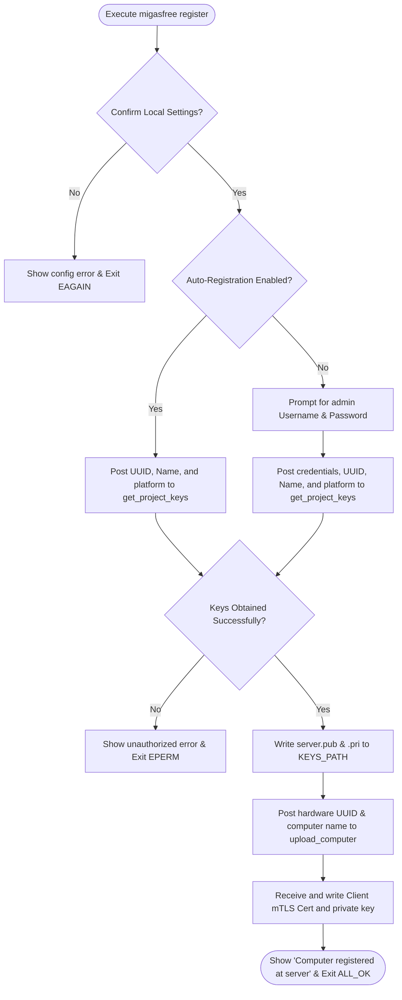

# CLI Command: register & identity

> **Namespace:** `migasfree register`, `migasfree import-mtls`, `migasfree remove-keys`
> **Access Privilege:** **Root / Administrator**
> **Scope:** Multi-platform (Linux & Windows)

---

## 1. Overview

The registration process is the initial onboarding step for any computer in the Migasfree fleet. It authenticates the machine against the server, enrolls it within a specific project deployment group, downloads asymmetrical cryptographic project keys (`server.pub` and `<project>.pri`), and establishes Mutual TLS (mTLS) certificates for subsequent communication.

---

## 2. CLI Usage Reference

### Register Computer

```bash
migasfree register [options]
```

| Parameter | Type | Required | Default | Description |
| :--- | :--- | :--- | :--- | :--- |
| `-u`, `--user` | `String` | No | `None` | Username authorized to register new machines in the targeted Migasfree project. |

### Import mTLS Certificates

```bash
migasfree import-mtls <cert_file_path>
```

| Parameter | Type | Required | Default | Description |
| :--- | :--- | :--- | :--- | :--- |
| `cert_file_path` | `String` | Yes | `None` | Tar archive (.tar) containing ready-made client certificate and private keys. |

### Remove Local Keys

```bash
migasfree remove-keys [options]
```

| Parameter | Type | Required | Default | Description |
| :--- | :--- | :--- | :--- | :--- |
| `-a`, `--all` | `Flag` | No | `False` | Removes client keys and configurations from all known servers instead of only the active one. |

---

## 3. Detailed Registration Flow

When `migasfree register` is run, it performs the following sequential actions:



### Verification Actions & Logic

1. **Settings Confirmation**: Before continuing, the client prompts the user for confirmation: `"Have you checked config options in this machine?"`. If answered no, the client instructs the user to configure settings and exits with `EAGAIN`.
2. **Interactive TTY redirection**: On Linux, the CLI automatically redirects `stdin` to `/dev/tty` if running interactively. This ensures administrative prompts can capture input correctly when executed via automated scripts or installers.
3. **Key Retrieval**: Posts a request to `/api/v1/public/keys/project/` with platform specifications, PMS backend, system architecture, and registration credentials.
4. **Key mapping**: The server's asymmetrical keys are converted locally:
   - `migasfree-server.pub` is mapped to `server.pub`.
   - `migasfree-client.pri` / `migasfree-packager.pri` is mapped to `<project>.pri`.
   These keys are written to `/var/migasfree-client/keys` (Linux) or `%PROGRAMDATA%\migasfree-client\keys` (Windows).
5. **Computer Enrolment**: Posts the computer's motherboard UUID, name, and IP address to `/api/v1/safe/computers/`.
6. **Certificate setup**: Retrieves client certificates for Mutual TLS (mTLS), writing them to `MTLS_PATH` for use in subsequent "safe" API endpoints.

---

## 4. Manual Identity Import (`import-mtls`)

For networks where auto-registration is disabled for security reasons, administrators can manually configure system certificates using `import-mtls`.

- **Input format**: Takes an uncompressed or compressed `.tar` file containing pre-generated client certificate (`cert.pem`) and private key.
- **Action**: Extracts archive content safely, validates file integrity, and moves certificates to `MTLS_PATH` while applying strict read-only permissions (`0600` on Linux) to secure the private key.

---

## 5. Security & Revocation (`remove-keys`)

If a machine is retired, reassigned, or compromised, administrators can revoke its identity using `remove-keys`.

- **Scope**: Deletes the entire `/var/migasfree-client/keys/` (Linux) or `%PROGRAMDATA%\migasfree-client\keys\` (Windows) directory.
- **Outcome**: The machine loses its administrative signature and certificate. Subsequent synchronization attempts will fail immediately with `EPERM` until a fresh `register` is executed.
