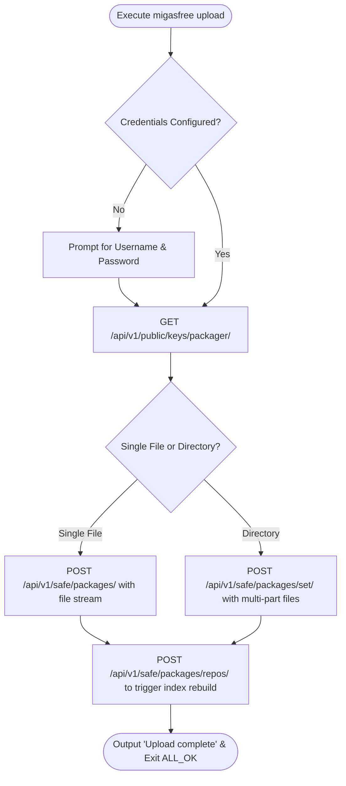

# CLI Command: upload

> **Namespace:** `migasfree upload`
> **Access Privilege:** **User (Authorized Packager)**
> **Scope:** Multi-platform (Linux & Windows)

---

## 1. Overview

The `upload` subcommand empowers package managers and system administrators to push custom-built packages (.deb, .rpm, .exe, .msi) or package sets directly to the Migasfree Server repository. This automates repository updates and makes new software packages immediately available for client synchronization.

---

## 2. CLI Usage Reference

```bash
migasfree upload [options]
```

### Authentication & Project Settings

| Parameter | Type | Required | Default | Description |
| :--- | :--- | :--- | :--- | :--- |
| `-u`, `--user` | `String` | No | `packager_user` from config | Username of authorized packager on the server. |
| `-p`, `--pwd` | `String` | No | `packager_pwd` from config | Password of authorized packager. |
| `-j`, `--project`| `String` | No | `packager_project` from config| Project repository to upload packages to. |
| `-s`, `--store` | `String` | No | `packager_store` from config | Targeted storage group on the server. |

### Upload Targets

> [!IMPORTANT]
> The `upload` command requires **exactly one** of the following mutually exclusive target arguments:

| Parameter | Type | Required | Default | Description |
| :--- | :--- | :--- | :--- | :--- |
| `-f`, `--file` | `String` | Yes (if no dir) | `None` | Path to a single package file to upload. |
| `-r`, `--dir` | `String` | Yes (if no file) | `None` | Path to directory containing multiple package files to upload in bulk. |

---

## 3. Upload & Repository Rebuild Flow

When packages are uploaded, the client executes the following lifecycle:



### Critical Business Rules

1. **Repository Index Rebuilding**: After files are successfully uploaded, the client MUST post to `/api/v1/safe/packages/repos/` to instruct the server to run repository indexing (such as running `apt-ftparchive` or `createrepo`). This ensures uploaded files are indexed and discoverable during the next client `sync`.
2. **Session Interruption**: Package file streams are transmitted securely. Large files are handled via chunked transfers. If transmission is interrupted, the client cleans up temporary upload descriptors on the server to prevent directory pollution.
